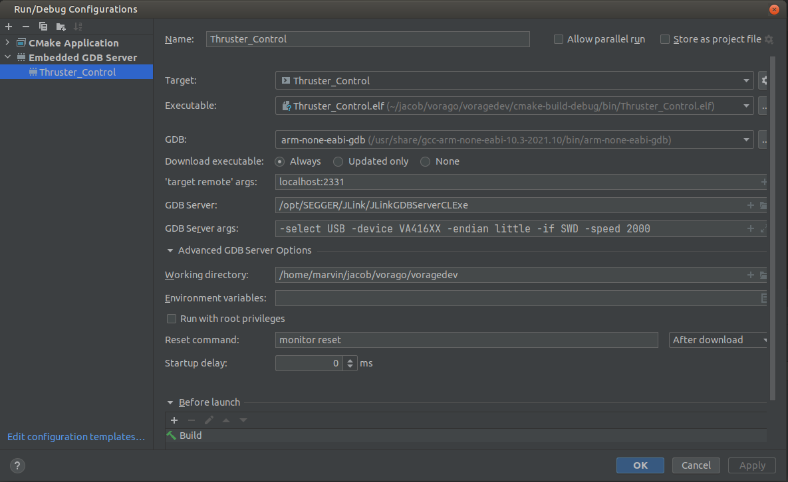

# Exoproject
Top level project to build a exoterra project. The top level stores cmake scripts, toolchain files and submodule links.

## Exoproject development

To build a user must pass in a project config and compiler config
EX:
- -DEXOPROJECT_CONFIG_FILE:STRING=$CMakeProjectDir$/project-configs/halo12-va41630-xenon-silver-boeing/hardware_control_proj_config.cmake
- -DEXOPROJECT_COMPILER_FILE:STRING=$CMakeProjectDir$/project-configs/halo12-va41630-xenon-silver-boeing/compiler_flags.cmake

## Development Environment Setup

### Install vmware workstation 16

```
under 
Z:\30 - ENGINEERING TEAMS\05 - SOFTWARE ENGINEERING\1 - Development VM\
There are vmware workstation installers for windows and linux.

Windows: double click and next next next the .exe

#Linux: 
chmod +x ./*.bundle
sudo ./VMware-Workstation-Full-16.2.4-20089737.x86_64.bundle
#and next next next the installer.
```

### Copy the vm to your local computer 

```
# Debian desktop environment:
Z:\30 - ENGINEERING TEAMS\05 - SOFTWARE ENGINEERING\1 - Development VM\ExoterraDevMachine.zip

# Ubuntu desktop environment:
Z:\30 - ENGINEERING TEAMS\05 - SOFTWARE ENGINEERING\1 - Development VM\02-ExoTerraUbuntuDevMachine.zip
```

### Launch the VM

The login for the default account is

```
User: exolab
Password: Exolab01
```

## Clone and Initialize Exoproject

```
git clone git@git.exoterra.local:software/firmware/system-control/exoproject.git
cd exoproject
git submodule init
git submodule update
git submodule foreach git checkout develop
```

## Branch Strategy

Exoterra projects have a main/master branch for tagged releases and a **develop** branch as the mainline branch for all development. Developers create private branches off develop for their work, then merge back to develop when a feature is complete. Develop is merged back to master and tagged when an official release is created.

## Exoproject Directory structure
```
.
├── cmake-scripts
├── cmake-toolchain
├── exodrivers
├── exomodules
├── hardwarecontrol
├── master-image-constructor
├── project-configs
├── third-party
├── thruster-control
└── tools
```

- **cmake-scripts** - General help scripts for cmake. Scripts that help set up important variables for our build system.
- **cmake-toolchain** - Cmake files that find the sysroot of a cross-compiler. Sets basic flags for debug and release builds.
- **exodrivers** - ???
- **exomodules** - Files that are common modules to any exoproject. Has project, gas, customer, coil and processor specific files.
- **hardwarecontrol** - Hardware control projects. Has project and processor specific files.
- **project-configs** - Stores configs to build projects. These configs set project variables.
- **third-party** - Libs that we did not create.
- **thruster-control** - Thruster control projects.
- **tools** - setup scripts.

Files that are shared between types of projects(as of now thruster-control and hardwarecontrol)

&nbsp;

# Building Exoproject from the command line

From the root folder, run the following command for hardware control:

```
cmake -B build/ -DEXOPROJECT_COMPILER_FILE:STRING=${PWD}/project-configs/halo12-va41630-xenon-silver-boeing/compiler_flags.cmake -DEXOPROJECT_CONFIG_FILE:STRING=${PWD}/project-configs/halo12-va41630-xenon-silver-boeing/hardware_control_proj_config.cmake -DCMAKE_EXPORT_COMPILE_COMMANDS=ON
```

From the root folder, run the following command for thruster control:

```
cmake -B build/ -DEXOPROJECT_COMPILER_FILE:STRING=${PWD}/project-configs/halo12-va41630-xenon-silver-boeing/compiler_flags.cmake -DEXOPROJECT_CONFIG_FILE:STRING=${PWD}/project-configs/halo12-va41630-xenon-silver-boeing/thruster_control_proj_config.cmake -DCMAKE_EXPORT_COMPILE_COMMANDS=ON
```

**NOTE** the final option (**-DCMAKE_EXPORT_COMPILE_COMMANDS=ON**) generates a compilation database (compile_commands.json) for use with the Sourcetrail codebase visualizer tool and is an optional step.

&nbsp;

# Sourcetrail Setup

[Sourcetrail](https://github.com/CoatiSoftware/Sourcetrail) is an open-source tool that allows visualization and navigation of the architecture for the Exoproject code base. The project was archived by the developers in 2021 but in its final state it supports C, C++, and Python on Windows, Linux and MacOS.

General steps for getting started with Sourcetrail.

1) [install Sourcetrail](https://github.com/CoatiSoftware/Sourcetrail/blob/master/DOCUMENTATION.md)
2) If you haven't already, explore the sample projects and tutorial
3) Create a compilation database for exoproject as part of the command line build process above
4) Create a new Sourcetrail project by importing the compilation database

The Compilation Database holds all information necessary for building the Sourcetrail project, such as source files, include paths and compiler flags. Having a Compilation Database makes project setup within Sourcetrail a lot easier. 

&nbsp;

# Creating a New Project

To create a new project add your code to the appropriate folder. Your project is responsible for creating your own cmake files. You will also need to create two cmake config files. \<project>_config.cmake and \<project>_compiler.cmake.

## \<project>_config.cmake 

Sets up important cmake variables for other project folders. Include cmake-toolchain file.

## \<project>_compiler_flags.cmake

Sets up compiler and linker flags.

## Important cmake vars

- EXOPROJECT_TOOLCHAIN_DIR - Toolchain dir so config can add toolchain cmake
- EXPROJECT_TARGET - Target name. Name is autogenerated by exo_create_project cmake function. add sources to this file
- EXOPROJECT_PATH - Root directory of project
- EXOPROJECT_APP_TYPE - application type under exoapss
- EXOPROJECT_APP - choose application under EXOPROJECT_APP_TYPE
- EXODRIVER_PROCESSOR - Chooses the type of processor to use. Drivers and some modules are processor 
  specific. ex: va41630, atmeg64m1
- EXOMOD_GAS  - eg. krypton or xenon
- EXOMOD_COIL - eg. copper or silver
- EXOMOD_CUSTOMER - code for customer, eg. bct

## Project setup

### Setting up build system in clion

1) Add cross-compiler to your PATH var.
2) Make sure segger tools are installed. (Look at setting up VM section)
3) run checkout.sh script to check out correct branches.
4) Open Clion.
5) In the project wizard find the project path to Exoproject
6) In clion goto File->Settings->Build,Execution,Development->Cmake
7) If it says to load a cmake file in the top right. Click that and choose the top level CMakelists.txt.
8) In the cmake options window either manually enter the variables discussed in Exoproject development or use the
   cache variable window
9) In the environment text box click the button on the right. Make sure clion has correctly inherited your path var.
   If not then goto File->Invalidate Caches...
10) Now in the configuration drop down menu(The dropdown bar are the right side next to the build icon) you should see
    Your project available to build

### Enable Clang Format

1) Goto File->Settings->Editor->CodeStyle
2) Check the box that says "Enable Clang formatting"

Each project you are build should have its own configuration. Follow steps above to add another project.

### Setting up segger debugger

1) In the configuration dropdown click Edit Configurations.
2) Click the plus and add embedded gdb server.
3) Choose your target to build.
4) Add the .elf file or other file if needed. Under cmake-build-x/bin/
5) Copy over the settings in the picture below.
   
6) You can create multiple configuration for each build you want to debug. Keep in mind speed and device will change if
   on a different processor or different debugger.
7) Paths for cross-compiller gdb, JLinkGDBServerCLExe, working directory could be different on your computer.

### Setting up xc8 compiler

1) Install avrdude
2) In clion goto the configurations window.
3) Click on the build configuration that is a xc8 project. 
4) On the bottom text box click that says before launch. Click the "+"
5) Add external external tool.
6) Find avrdude under /usr/bin/avrdude
7) For program args use this:
```
avrdude -c atmelice_isp -p m64m1 -U flash:w:$CMakeCurrentLocalBuildDir$/$CMakeCurrentTargetName$.hex 
```
