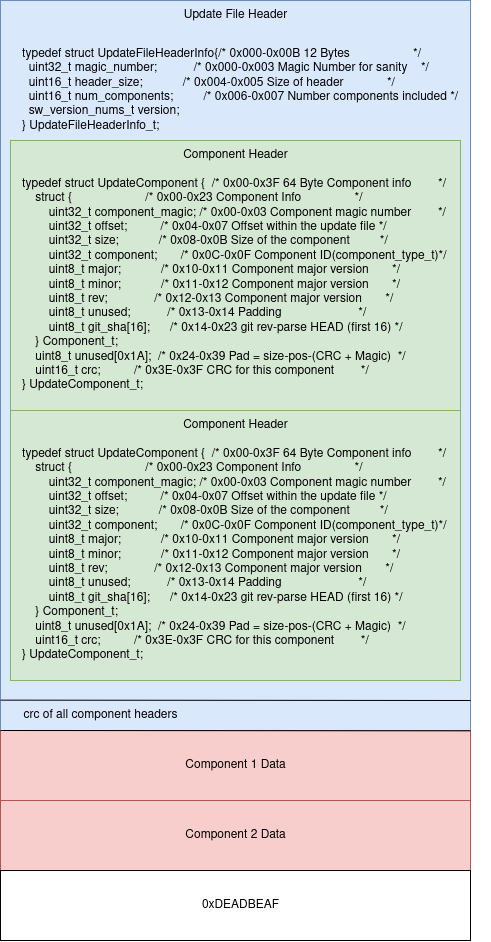

# Update Binary
## Update Memory Layout
### Update File Header
An update binary can consist of multiple application or components binary (ie. system control, anode, magnets, ...). 
The start of a file has a header that describes:
- A magic number to validate its an update
- How many components exist in the update binary
- Size of a component header for future proofing
- Software version
- A crc of all component headers 

###  Component Header
Each component binary has a corresponding component Header. The component header describes:
- A magic number that indicates what component it is.
- An offest into the update binary where its corrospnding component bin exists.
- The size of the component binary
- A component ID
- A major, minor, and rev for versioning.
- A gitsha 
- A CRC of the component binary

### Component Data
Component Data is the component binary.

### 0xDEADBEAF
0xDEADBEAF is the update binary signature.




## Master Image constructor
Master Image Constructor is what creates an update binary. It uses the storage and update modules. 
It needs the update structs to package the update header.

## Manifest 
The manifest is used by Master Image Constructor to generate an update binary. 
The Manifest is a file that stores a list of:
- Path to component binary
- Magic number of component
- Git sha of component's repo
- Major, minor, rev for versioning
```
#Path:Device Id:Magic Number:Git SHA:VersionMajor.VersionMinor.Revision
/tmp/system_control.bin:0:61646373:d226e385:2:2:2
/tmp/anode.bin:1:61646e61:ffa68321:1:1:1
.
.
.

```
There is a script our CI/CD uses to generate a manifest for Master Image Constructor.

## Generate Update Binary
1. Build Master Image Constructor for x86.
2. Generate a manifest for all component used
3. Run mic: ./mic.bin \<name of update bin> -b \<manifest file>