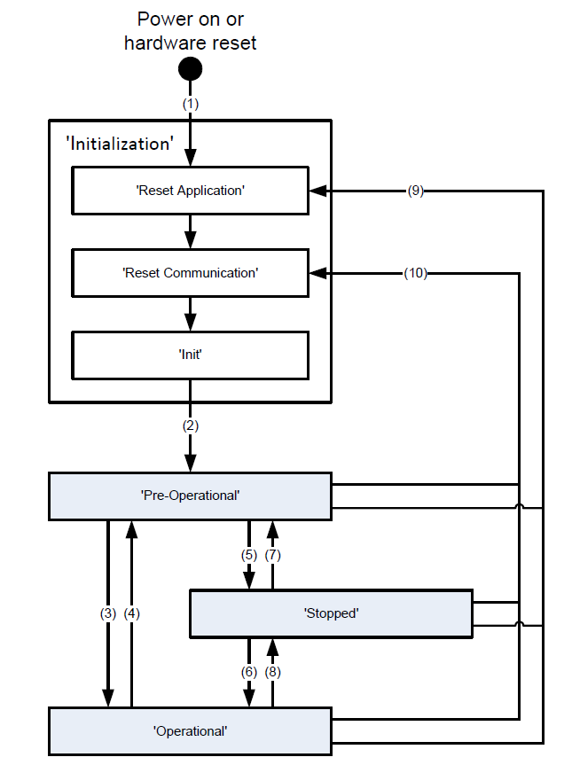
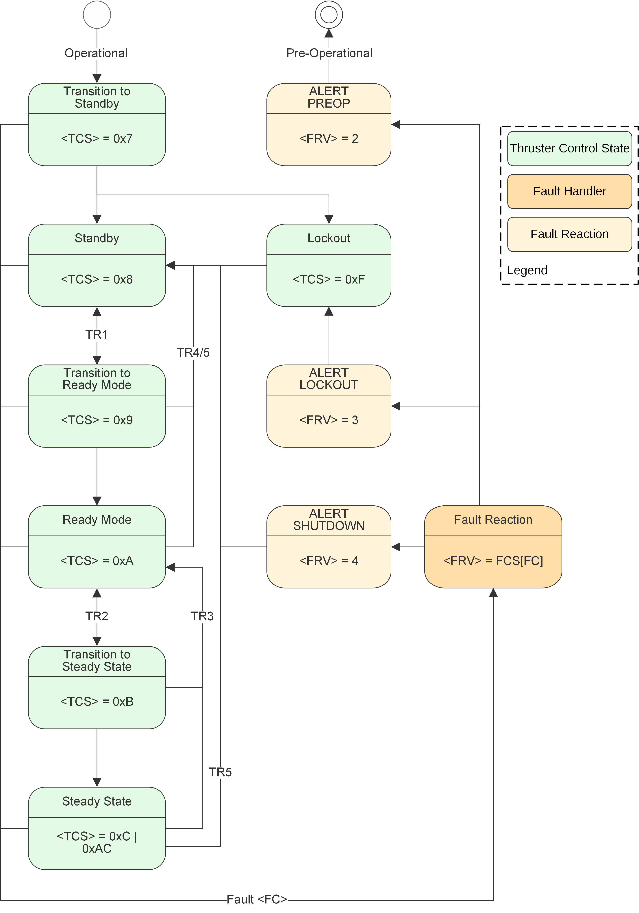
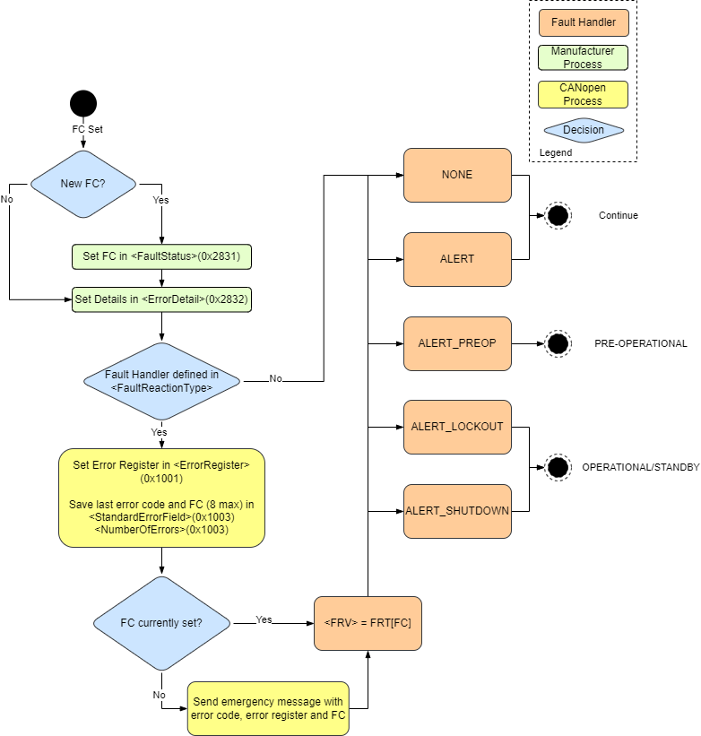
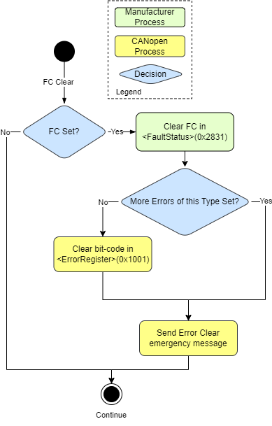

# CANopen References

The table below gives reference material that can be used to understand and properly use the CANopen protocol. Layers not specified in the below table are not applicable to the ExoTerra system.

| Layer   | Description       | References for CAN/CANopen |
| ------- | ----------------- | -------------------------- |
| Layer 7 | Application Layer | CiA 301; CiA 305           |
| Layer 2 | Data Link Layer   | ISO 11898-1; CiA 305       |

# Network Management State Machine (NMT state machine)

The CANopen network management (NMT) state machine is used to control the network state and define slave device communication behavior. The network management is node-oriented and follows a master/slave structure.  It requires one device in the network, which fulfills the function of the NMT master, the other nodes are NMT slaves. The network management provides device control services for initialization and start-up of NMT slave nodes. The Propulsion Module is a NMT slave.

__NOTE:__ The CANopen network management state machine must not be mistaken with the Thruster Control State (TCS) machine.

The CANopen NMT state machine is shown in the below diagram.

The master controls the state transitions of each device in the network. After power-on, the device is initialized and set to the state 'Pre-Operational' automatically. In this state reading and writing to its object dictionary via the service data objects (SDO) is possible. Afterwards the device can be switched into the 'Operational' state by the NMT command "Operational Standby Mode (STNDBY)". The network master can then switch the remote node back to 'Pre-Operational' by using the command "Go to Pre-Operational/Low Power Mode".

NMT states transitions are caused by:
- Reception of an NMT node control service
- Hardware reset
- Node control services locally initiated by application events and fault handling

| Transition | Description                                                                                                     |
| ---------- | --------------------------------------------------------------------------------------------------------------- |
| (1)        | At Power On the NMT state initialization is entered autonomously                                                |
| (2)        | NMT stat initialization finished - enter NMT state Pre-operational automatically (Boot-up message will be sent) |
| (3)        | Receive NMT command "Go to Operational Standby Mode"                                                            |
| (4),(7)    | Receive NMT command "Go to Pre-Operational/Low Power Mode"                                                      |
| (5),(8)    | Receive NMT command "Go to Stopped Mode"                                                                        |
| (6)        | Receive NMT command "Go to Operational Standby Mode"                                                            |
| (9)        | Receive NMT command "Reset Application"                                                                         |
| (10)       | Receive NMT command "Reset Communication"                                                                       |

Services on the listed communication objects may only be executed if the CANopen device is in the appropriate NMT state. Available services for each NMT state are detailed below.

| NMT state        | SDO | PDO | EMCY | NMT |
| ---------------- | --- | --- | ---- | --- |
| STOPPED          |     |     |      | X   |
| Pre-Operational  | X   |     | X    | X   |
| Operational      | X   | X   | X    | X   |

The NMT state control commands are detailed in the Electrical and Software ICD.

# Thruster Control State Machine

The thruster control state machine is entered when the ECP has successfully transitioned to the operational state. At this time the thruster will autonomously enter the 'Transition To Standby' state.  Prior to entering 'Transition to Standby', the Thruster Control State (TCS) values mirror the NMT state. Subsequent TCS meanings are detailed in the state machine description below. Thruster Control State values are detailed in the Electrical and Software ICD and can be read at \<Thruster Command-Status\>(0x4000-0x5)

 For normal operation, the Transitions Requests (TR#'s) are accomplished through user commands sent to the ECP. States that are not initiated by a Transitions Request (TR) are autonomous, i.e. state changes from 'Transition to Standby' to 'Standby', 'Transition to Ready Mode' to 'Ready Mode', and "Transition To Steady State" to "Steady State". The specific command structure is detailed in the Electrical and Software ICD, and the below table summarizes the TR commands that are used.

 | Transition Request | Description                                 | Index  | Sub-Index | Write Value |
 | ------------------ | ------------------------------------------- | ------ | --------- | ----------- |
 | TR1                | Go to Ready Mode (Keeper On)                | 0x4000 | 0x1       | 1           |
 | TR2                | Go to Steady State (Anode On)               | 0x4000 | 0x2       | 1           |
 | TR3                | Go back to Ready Mode (Anode Off/Keeper On) | 0x4000 | 0x2       | 0           |
 | TR4                | Turn Keeper Off                             | 0x4000 | 0x1       | 0           |
 | TR5                | Go back to Standby (Thruster Shutdown)      | 0x4000 | 0x3       | 1           |

## Expected Actions During State Transitions

The sections below details the actions that the software and hardware take when the state transitions occur. If any of the below steps do not execute properly a Fault Code (FC) may be thrown. If a Fault Code is thrown, the Fault Handler will look up the defined Fault Reaction Value (FRV) for the detected FC in the Fault Code Select (FCS) array (__\<FRV\> = FCS[\<FC\>]__). The fault codes and fault reactions are detailed in the Fault Handling section of the user guide and Electrical and Software ICD. If a Fault Code is not thrown and the transition does not complete successfully, the thruster will transition back to the previous state.

__NOTE:__ Transitioning back to Ready Mode from "Steady State" with the keeper turned off is not currently supported. If TCS is 0xAC, the thruster is in "Steady State" with the keeper on and TR3 will transition back to Ready Mode. If TCS = 0xC, the keeper is off and TR3 will autonomously transition all the way back to Standby.

### Transition to Standby (Autonomous)
Once the ECP is Operational, the TCS machine enters 'Transition to Standby'autonomously. The steps taken during this transition include:

1.  Change TCS to "Transition to Standby"
2.  Boot load all client MCUs (keeper, anode, inner magnet, outer magnet, and valves)
3.  Set all thruster controls to their default states
4.  Perform all initial health and status checks
5.  Change TCS to "Standby"

A failure in this state will cause the system to go back to the NMT Pre-Operational mode.

### Transition to Ready Mode (TR1)

After the user issues TR1, the unit will start the sequence for cathode ignition. These steps include:  

1.  Change TCS to "Transition to Ready Mode"
2.  Open the Latch Valve
3.  Open the Cathode High Flow valve
4.  Issue the Keeper start command
    1.  Run the Keeper converter and turn on the Keeper start circuitry with a startup voltage/current limit
    2.  Expect the output to reach >450V for all input voltages (>500V for 26V and above voltage input)
    3.  Spark across the Keeper/Cathode nodes until the Halo thruster bridges
5.  If ignition is successful, open the Cathode Low Flow valve to the desired starting set point
6.  Close the Cathode High Flow Valve
7.  Throttle the Keeper current and Cathode Low Flow valve to the final "Ready Mode" values
8.  Change TCS to "Ready Mode"

### Turn Keeper Off (TR4)

If the user is in "Ready Mode" or "Transition to Ready Mode", TR4 may be sent to abort the Cathode ignition, or return to Operational Standby without putting the thruster into Hall-Effect mode. This will return the unit to the Operational Standby state and will shut down all thruster related functions. These steps include:  

1.  Turn off the Keeper voltage supply
2.  Close the Cathode Low Flow Valve
3.  Close the latch valve
4.  Change TCS to "Standby"

__NOTE:__ If the TCS = 0xAC, the Thruster is in "Steady State" mode with the Keeper on. In this case TR4 is simply 'Keeper Off'. This command will turn off the keeper and keep the thruster in "Steady State" (TCS = 0xC).

### Transition to Steady State (TR2)

After the user issues TR2, the unit will put the thruster into Hall-Effect mode using the sequence:  

1.  Change TCS state to "Transition to Steady State"
2.  Adjust Keeper current and Cathode Low Flow valve to "start" ranges
3.  Turn on Magnets
4.  Turn on Anode Flow valve
5.  Issue the Anode start command
    1.  Run the Anode converter in "thruster startup mode" with a set voltage/current limit
    2.  Expect the output to oscillate around 200V for all input voltages
    3.  Spark across the anode/cathode nodes until the Halo thruster bridges
    4.  Anode converter outputs a constant voltage in the Hall-Effect mode
6.  Verify the Anode ignition is successful
7.  Turn the Keeper off (unless specifically needed for custom set point)
8.  Throttle to the starting set point
9.  Change TCS to the "Steady State"

When the user is in "Steady State", the thruster can be throttled to any set point detailed in the throttle table. The throttle table details are shown in the Throttle Section of the User Guide.

### Transition back to Ready Mode (TR3)

When in "Steady State"  with the keeper on (TCS = 0xAC), the user can transition back to ready mode by issuing TR3. These steps include:  

1.  Turn off the Anode Voltage Supply
2.  Turn off the Keeper Voltage Supply
3.  Turn off the Magnet supply
4.  Turn off Anode Flow valve
5.  Change TCS to "Standby"

If the keeper is off, the thruster will also transition back to Standby. In this case TR3 is effectively TR5.

### Transition back to Standby (TR5)

At any point during thruster operation or startup TR5 may be sent by the user. When this command is received, the ECP takes all necessary steps to stop thruster operation and return the unit to the "Standby" state. These steps include:  

1.  Turn off the Anode Voltage Supply (if on)
2.  Turn off the Keeper Voltage Supply (if on)
3.  Turn off the Magnet supply (if on)
4.  Close all Proportional Control Valves
5.  Close the latch valve
6.  Change TCS to "Standby"

## Thruster Turn-On Summary

Below is a summary of the thruster bring up process. For brevity, the error handling is omitted. In general, if the current TCS changes to anything other than what is the next expected state, it is an error.  

1.  Go to NMT Operational
2.  Poll \<THCMD-Thruster Control State\>(0x4000-0x05) until its value changes from Pre-Operational (0x2), to Operational (0x3), to Transition Standby (0x7), and then finally to Standby (0x8).
  __Note__ These transitions may happen faster than they can be read, especially the states from "Pre-Operational" to "Transition to Standby".  
3.  Send TR1, write a 1 to THCMD-Ready Mode (0x4000-0x01)
4.  Poll \<THCMD-Thruster Control State\>(0x4000-0x05) until it changes from "Transition Ready Mode" (0x9) to "Ready Mode" (0xA)
5.  Send TR2, write a 1 to \<THCMD-Steady State/>(0x4000-0x01)
6.  Poll \<THCMD-Thruster Control State\>(0x4000-0x05) until it changes from "Transition Steady State" (0xB) to "Steady State" (0xC or 0xAC)

# Throttle to setpoint

In "Steady State", a throttle command may be sent to adjust thruster parameters to get various combinations of power and thrust. The table is defined in the Throttle Table section. To throttle to a set point, write the set point number to \<THCMD-Thruster Command\>(0x4000-0x04).

# Conditioning

Each conditioning step consists of two sub-steps, a setup sequence and a monitoring loop. During conditioning, the current step, status of the setup sequence, elapsed time of the monitoring sub-step (milliseconds), and any error during monitoring sub-step are saved in non-volatile memory. The current step can be read at \<CSTAT-Current Step\>(0x4001-0x1). The status of the step can be read at the higher Sub-Indexes. For example, the status of step 1 can be read at Sub-Indexes 0x2-0x4, the second is at Sub-Indexes 0x5-0x7, and so forth.

Conditioning is initiated by writing the step number to \<THCMD-Condition\>(0x4000-0x6). Conditioning should start with step 1. The ECP will progress through each subsequent step autonomously. However, if a failure occurs it can be restarted at any step. For example, if the keeper has an error during step 3, the conditioning process can be restarted at that step by writing a 3 to \<THCMD-Condition\>(0x4000-0x6).

Note, some steps have a pre-requisite state. For example, if any of the Anode Conditioning steps need to be restarted, the PPU needs to be in "Ready Mode" before attempting to restart the conditioning at that step. See the Electrical and Software ICD for details on steps numbers and pre-requisite modes.

## Conditioning Steps

|  Step   | Name               | Description                                 | Pre-Requisite Mode | Run-Time (hours) |
|  -----  | ------------------ | ------------------------------------------- | ------------------ | ---------------- |
|    1    | Magnet Condition   | Gas Purge/Coil Bakeout                      | STANDBY            | 1.25             |
|    2    | Keeper Condition 1 | Cathode Conditioning at setpoint 1          | STANDBY            | 1.00             |
|    3    | Keeper Condition 2 | Cathode Conditioning at setpoint 2          | READYMODE          | 0.50             |
|    4    | Keeper Condition 3 | Cathode Conditioning at setpoint 3          | READYMODE          | 0.50             |
|    5    | Keeper Condition 4 | Cathode Conditioning at setpoint 4          | READYMODE          | 1.00             |
|    6    | Anode Condition 1  | Low Power Thruster Operation at setpoint 1  | READYMODE          | 0.50             |
|    7    | Anode Condition 2  | Low Power Thruster Operation at setpoint 2  | STEADYSTATE        | 0.50             |

# Fault Handling

When a fault is first detected a high priority Emergency (EMCY) message is sent.  Subsequent faults with the same Fault Code will not produce new EMCY messages until the fault has been cleared.  When a fault is cleared an EMCY message containing all zeros is sent.  Refer to the Electrical and Software ICD for details on decoding EMCY messages.

Fault information can be queried from the ECP object dictionary at \<Error-Register\>(0x1001), \<Error-History\>(0x1003), and \<FaultStatus\>(0x2831). The \<Error-Register\>(0x1001) displays information about the error state of the system, \<Error-History\>(0x1003) is a list of the last seven reported errors, and \<FaultStatus\>(0x2831) is a bit mask in which bit positions correspond directly to Fault Codes that are currently set.  Refer to the Electrical and Software ICD for details.

Each Fault Code has a Fault Reaction Value (FRV) assigned to it.  When a fault is detected, the Fault Handler will look up a pre-defined Fault Reaction Value (FRV) in a Fault Code Select (FCS) array (__\<FRV\> = FCS[\<FC\>]__).  The corresponding Fault Reaction is then executed by the ECP.  Fault Codes and Fault Reaction information can be found in the Fault Table and Fault Reaction Type section of the Electrical and Software ICD.

# Fault Set

# Fault Clear

Module-specific debug information can be queried from the object dictionary using MEL-Module Error Log(0x2832-0x0,0x1,0x2,0x3,0x4,0x5). The data returned from these index/subindex pairs can be read directly into the data structures detailed in the MEL Module Error Log (0x2832) table in the Electrical and Software ICD.

# Electronic Data Sheet (EDS) Files

Electronic data sheets (EDS) are files which describe the capabilities and the communication objects of a CANopen device. The EDS file is used to configure CANopen master devices. The ECP EDS file can be provided by ExoTerra to aid the user with software development.

# Firmware Updates

## Reprogramming Sequence

The reprogramming sequence is as follows:

1.  User asserts “Reprogram” discrete on external connector if applicable
2.  Perform SDO upload of binary update file to Program Sub-Index in the Reprogram table
3.  An integrity check is performed by the ECP when the last data packet is received. The transfer will fail if the integrity check fails. The integrity check can be repeated at any time using the Verify Sub-Index in the Reprogram Table.
4.  Client writes a ‘1’ to the Install Sub-Index in the Reprogram Table to trigger the install process
5.  ECP boot loader image is copied into executable memory by ECP application and the unit is reset
6.  The boot loader installs the new ECP application and all redundant device images
7.  The next time the system is put into Operational mode the ECP will boot load all client MCUs with the newly installed version

## Verification and Integrity Check

An integrity and verification check of the update binary is performed after three different events. The first is upon completion of the initial file transfer. If the verification fails at this step, the entire transfer will fail. The second is upon request to install the update, \<Prog-Install\>(0x5500-0x3). If the verification fails at this step, the installation will not be performed. The third is upon request, /<PROG-Verify\>(0x5500-0x2). The verification result can read back at \<PROG-Verify\>(0x2) subsequent to any of the three verify events. If the verify fails, the write to /<PROG-Verify\>(0x5500-0x2) will also fail.

### Verification value

The verification performs an integrity check of each of the components contained in the update binary. An update binary contains a component for each of the MCUs, the ECP, and the ECP boot loader. The verification value is a bit mask of each component that was successfully verified. A value of zero indicates no components were successfully verified. Component bits are shown in the table below.

| BIT | Component                    |
| --- | ---------------------------- |
| 0   | Thruster Control             |
| 1   | Keeper                       |
| 2   | Anode                        |
| 3   | Magnets                      |
| 5   | Valves                       |
| 6   | Thruster Control boot loader |

A value of 0x6F indicates that all components have verified successfully and the firmware update can be installed.

# Built In Test Sequences

## Stand Alone Unit Testing

Prior to integration into the user module, the user may connect to the ExoTerra Propulsion Module and run basic built-in test sequences to verify functionality of the unit. To connect to the unit and run BITs from an external computer, the below connections should be made.

### Electrical Connections

Caution: The following section details connector and harness installation. Connectors must be installed by alternately turning the screws, slowly walking the connector down until fully seated. Turning one screw all the way down before the other WILL damage the connector and bend pins.

1.  Inspect Module Connectors P030, P032, P003 for damage, bent pins, and FOD.
2.  Inspect connectors on test cable for damage, bent pins, and FOD prior to mate.
3.  Verify isolation between 28V input power and pwr return, referencing the below pinout (note all HCx_ARM signals are tied together and all HCx_RTN signals are tied together in the module). The impedance should be greater than 10kOhm
4.  Connect Power Connector, P030, to a lab power supply following the pinout shown below
5.  Connect the Communication Connector, P032, to an RS-422 external interface following the pinout shown below

| Pin Number         | Signal Name | Signal Characteristics                |
| ------------------ | ----------- | ------------------------------------- |
| 1,2,17,18          | HC1_ARM     | Propulsion Power ARM; 28V Input Power |
| 4,5,20,21          | HC1_RTN     | Propulsion Power Return               |
| 9,10,25,26         | HC2_ARM     | Propulsion Power ARM; 28V Input Power |
| 6,7,22,23          | HC2_RTN     | Propulsion Power Return               |
| 11,12,27,28        | HC3_ARM     | Propulsion Power ARM; 28V Input Power |
| 14,15,30,31        | HC3_RTN     | Propulsion Power Return               |
| 3,8,13,16,19,24,29 | NC          | NOT CONNECTED                         |

| Pin Number | Signal Name | Signal Characteristics          |
| ---------- | ----------- | ------------------------------- |
| 1          | SC_CMD_P    | RS-422 High (Spacecraft to PPU) |
| 2          | SC_CMD_N    | RS-422 Low (Spacecraft to PPU)  |
| 3,6        | DRTN        | Signal Return                   |
| 4          | SC_TLM_P    | RS-422 High (PPU to Spacecraft) |
| 5          | SC_TLM_N    | RS-422 Low (PPU to Spacecraft)  |

## BIT After Integration into Spacecraft

All BIT sequences can be run from a Flight computer or equivalent after integration into the spacecraft. After flight harnesses are installed and unit is turned on, the process for running a BIT sequence is the same as when running with user developed software on an external computer.

## Turn On and Startup

1. Turn on the Power Supply or enable thruster power in the spacecraft. An external supply should be set to 28V +/- 4V. If input current is monitored, expect to see 0.1-0.2A when the unit is first turned on.
2. Command the unit to go to the Thruster Standby State by sending the State Control command to Go to Operational Standby Mode *(STNDBY) as described in the "State Control and Initialization" section of the ICD.
3. This command will enable power to all the downstream MCUs in the system and DIAG information will become available.
4. The user may monitor the Thruster Control State by monitoring \<THCMD-Thruster Control State\>(0x4000-0x05). The unit will return the state 0x8 when it has successfully transitioned to Operational Standby Mode. If input current is monitored, expect to see 0.3-0.4A in Operational Standby Mode.

## Valve BIT Sequences

1.  If there is a reference pressure in the tank, the pressure in the tank can be read by monitoring the \<DIAG5-Tank Pressure (mPSI)\>(0x3500-0x5) data.
2.  If there is a reference pressure in the tank, keep all proportional valves closed, and open the latch valve by setting \<THCMD-BIT\>(0x4000-0x7) to 2. This will issue the Latch Valve Open BIT command.
3.  You should now see a regulated pressure of 40 PSI (40000 mPSI) when monitoring the DIAG5-Regulator Pressure (mPSI) (0x3500-0x8) data.
4.  Ensure the Latch Valve is closed by setting \<THCMD-BIT\>(0x4000-0x7) to 3 to issue the Latch Valve Close BIT command.
5.  Test the Cathode high flow valve by setting \<THCMD-BIT\>(0x4000-0x7) to 6 to issue the PCV Drain BIT command.
6.  Monitor the \<DIAG5-Cathode HF Voltage (mV)\>(0x3500-0x2). The value of the data returned should increase to a larger number (usually >14000 mV). This may take a few seconds.
7.  This BIT sequence has a long timeout, as it is used to drain the tubing between the latch valve and vacuum chamber during checkout. Exit the BIT sequence when you see \<DIAG5-Cathode HF Voltage (mV)\>(0x3500-0x2) change. Send the BIT abort command by setting \<THCMD-BIT\>(0x4000-0x7) to 0.
8.  If running BIT sequences at ambient pressure, test the cathode low flow valve by setting \<THCMD-BIT\>(0x4000-0x7) to 'b' to issue the LF Valve Check Ambient.
9.  If running BIT sequences in a vacuum environment, test the cathode low flow valve by setting \<THCMD-BIT\>(0x4000-0x7) to 4 to issue the LF Valve Check Vacuum command.
10. Monitor the \<DIAG5-Cathode LF Voltage (mV)\>(0x3500-0x3). The value of the data returned should increase to a larger number (usually >14000 mV). This may take a few seconds.
11. Monitor the \<DIAG5-Cathode Pressure (mPSI)\>(0x3500-0x6) data. As the Cathode LF valve is opened, the pressure sensor should read back the approximate pressure of the test environment (ambient or vacuum).
12. The cathode low flow test will timeout after 30 seconds. To end the test prior to the timeout, send the BIT abort command by setting \<THCMD-BIT\>(0x4000-0x7) to 0 when \<DIAG5-Cathode LF Voltage (mV)\>(0x3500-0x3) changes.
13. If running BIT sequences at ambient pressure, test the anode valve by setting \<THCMD-BIT\>(0x4000-0x7) to 'c' to issue the Anode Valve Check Ambient command.
14. If running BIT sequences in a vacuum environment, test the anode valve by setting \<THCMD-BIT\>(0x4000-0x7) to 5 to issue the Anode Valve Check Vacuum command.
15. Monitor the \<DIAG5-Anode Voltage (mV)\>(0x3500-0x1). The value of the data returned should increase to a larger number (usually >14000 mV). This may take a few seconds.
16. Monitor the \<DIAG5-Anode Pressure (mPSI)\>(0x3500-0x7) data. As the Anode valve is opened, the pressure sensor should read back the approximate pressure of the test environment (ambient or vacuum).
17. The anode valve test will timeout after 30 seconds. To end the test prior to the timeout, send the BIT abort command by setting \<THCMD-BIT\>(0x4000-0x7) to 0 when \<DIAG5-Anode Voltage (mV)\>(0x3500-0x1) changes.

## HALO BIT Sequences

1.  Test the Inner Magnet Coil circuit by setting \<THCMD-BIT\>(0x4000-0x7) to 7 to issue the Inner Coil Test BIT command.
2.  Monitor the \<DIAG4-Iout (mA) (0x3004-0x2)\>. The value of the data returned should increase to approximately 2A (2000 mA). This may take a few seconds.
3.  The test will timeout after 1 minute. To end the test prior to the timeout, send the BIT abort command by setting \<THCMD-BIT\>(0x4000-0x7) to 0 when \<DIAG4-Iout (mA)\>(0x3004-0x2) changes.
4.  Test the Outer Magnet Coil circuit by setting \<THCMD-BIT\>(0x4000-0x7) to 8 to issue the Outer Coil Test BIT command.
5.  Monitor the DIAG3-Iout (mA) (0x3003-0x2). The value of the data returned should increase to approximately 2A (2000 mA). This may take a few seconds.
6.  The test will timeout after 1 minute. To end the test prior to the timeout, send the BIT abort command by setting \<THCMD-BIT\>(0x4000-0x7) to 0 when \<DIAG3-Iout (mA)\>(0x3003-0x2) changes.
7.  Test the Keeper Supply by setting \<THCMD-BIT\>(0x4000-0x7) to 9 to issue the Keeper Test BIT command.
8.  Monitor the \<DIAG1-SEPIC Voltage (mV)\>(0x3001-0x1). The value of the data returned should increase to approximately 90V (90000 mV). This may take a few seconds. The timeout for this test is very short and the voltage will spike and decay quickly. Be prepared sample \<DIAG1-SEPIC Voltage (mV)\>(0x3001-0x01) at a high frequency.
9.  Test the Anode Supply by setting \<THCMD-BIT\>(0x4000-0x7) to 'a' to issue the Anode Test BIT command.
10. Monitor the \<DIAG2-Vout (mV)\>(0x3002-0x03). The value of the data returned should increase to approximately 200V (200000 mV). This may take a few seconds. The timeout for this test is very short and the voltage will spike and decay quickly. Be prepared to sample \<DIAG2-Vout (mV)\>(0x3002-0x03) at a high frequency.
11. At this point all BIT tests have been completed. The unit can be powered down and disconnected from test equipment if necessary.

# Appendix: Supplied Python Scripts

ExoTerra provides python scripts that can be used to run BIT sequences without any user developed software. For details on the use of those scripts, refer to the ExoTerra Prop Module Supplied Python Script Guide, 1460010023.
