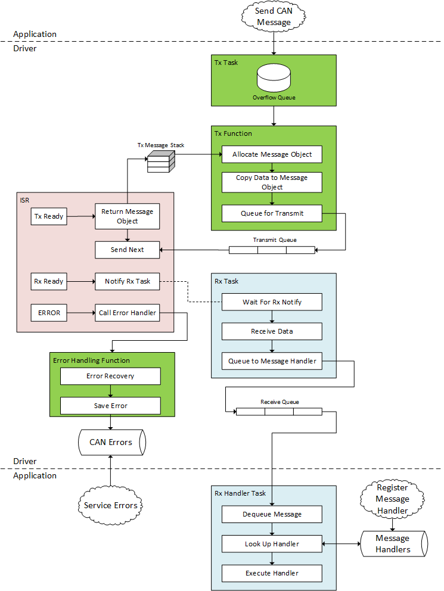
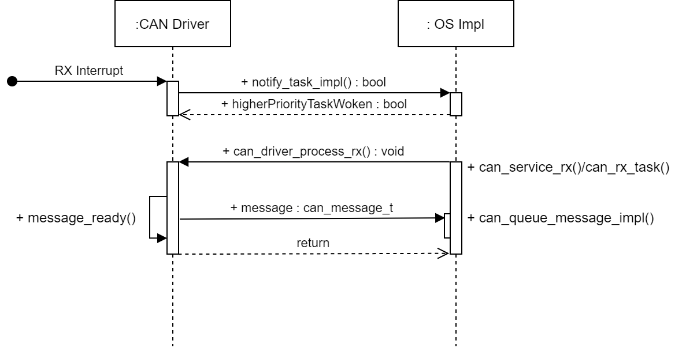

# __CAN Driver and Message Handling Implementation__

## __Scope__
This document covers the design of the CAN driver and message handling strategies.  This document depends on other designs, such as an Operating System Abstraction Layer and utilities such as queues and stacks.  The design for those can be found here:

__TODO__ link other docs here

This CAN driver design is targeted to the Vorago processor.  Register set definitions and acronyms can be found here:

__TODO__ link data sheet here

# __Assumptions__

The CAN driver design shall support both a Bare Metal and a multi-tasking Real Time Operating System (RTOS).  The application shall access all CAN message Tx/Rx and initialization functions through the RTOS or Bare Metal implementation.  The application shall never make direct calls into the hardware level implementation.

The target RTOS is FreeRTOS, however the design shall support easily switching to a different RTOS with similar capabilities.

The high-level design diagrams depict 'tasks' as if they are running in an RTOS, however the detailed design will outline a structure in which there is a service function called periodically by the application to accomplish the operations shown in the 'tasks'.  

# __Top Level Architecture__



## __Data Structures__

The driver shall have four private data structures for handling messages:

-  __Tx Message Stack__ - Stack of available hardware message buffers used for transmitting CAN messages.  All messages buffers allocated for transmit shall be pushed onto the stack upon driver initialization.  Message buffers are popped off the stack when the application calls the Tx Function.  They are pushed back onto the stack by the ISR when Tx is complete
-  __Transmit Queue__ - The Transmit Queue holds outstanding hardware message buffers.  The Tx Function shall place hardware messages buffers that are ready to be sent in the Transmit Queue.  The ISR shall dequeue outstanding messages from the Transmit Queue when the message is done sending.
-  __Transmit OverFlow Queue__ - The Overflow Queue is used to hold overflow messages in the case where the Tx Message Stack is empty.  This is used as extra buffering when the number of hardware buffers allocated for transmit is insufficient for a transmit burst.
-  __Receive Queue__ - The Receive Queue shall be used to hold incoming messages.  The driver shall copy messages from the hardware buffers and store them in the Receive Queue.  The driver shall provide an interface for accessing and dequeueing outstanding messages.

## __Tx Function__
The Bare Metal and RTOS implementations shall expose a Tx Function to the application.  When the application needs to send a CAN messages it utilizes the Tx Function.  The Tx Function does the following:

- Pop a hardware message buffer off of the Tx Message Stack or saves message in a queue if no hardware buffers are available
- Write Data, ID, and Data Length as necessary
- Push message buffer into the Transmit Queue

__NOTE:__ the Tx Function does __not__ write TX_ONCE in the CNSTAT register, unless there are no outstanding messages in the Transmit Queue.  This is done in the ISR so that TX messages are sent in the order that the application sends them to the driver.  If there are no outstanding messages in the Transmit Queue, then the Tx Function must write TX_ONCE to CNSTAT register in order to 'prime the pump'.

In the RTOS implementation the Tx Function shall block with a timeout in the case where no more room in the Overflow Queue.  A timeout waiting for space in the the will return an error.  If the Tx Message Stack is empty, the Tx Task must wait until the ISR pushes a message buffer onto the stack.  If the timeout expires before the a hardware message buffer is available on the stack, the Tx function shall log an error.

In the Bare Metal implementation an empty stack will simply return an error.

Operations with the Tx Message Stack and Transmit Queue shall be atomic and must not be interrupted by CAN Tx interrupts to prevent concurrency issues with the Tx.

## __Rx Task__
The Rx Task is responsible for receiving CAN data and making hardware message buffers ready to receive again as quickly as possible.  The message id, data length, and data shall be copied out of the hardware message buffer and into a data structure.  The data structure shall then be inserted into the Receive Queue for the application to process later.  In the event that the Receive Queue is full, an error shall be set and the message shall be dropped.

The Rx Task shall be notified by the ISR when an Rx interrupt is received.  The Rx interrupt shall then be disabled by the ISR.   The Rx Task will receive all outstanding messages.  When no more messages are available for Rx, the Rx Task shall re-enable the Rx interrupt and then go back to waiting for a new notification.

## __Interrupt Service Routine (ISR)__

The ISR shall be responsible for:
- Notifying the Rx Task that one or more messages are ready to be received
- Dequeuing messages buffers from the transmit queue and returning them to the Tx Message Stack
- Enable transmit in the next available Tx message in the Transmit Queue
- Handle any error interrupts

### __Transmit Interrupts__
The driver shall enable Tx interrupts so that the peripheral creates an interrupt when a hardware message buffer has finished transmitting.  On a Tx interrupt the ISR shall dequeue the hardware message buffer from the Transmit Queue and push it back onto the Tx Message Stack, making it available for the application to send another Tx message.  Then it shall set TX_ONCE in the hardware message buffer at the head of the Transmit Queue to trigger transmit of the message buffer.

### __Receive Interrupts__
Upon reception of an Rx interrupt the ISR shall disable further Rx interrupts and notify the Rx Task that at least one message buffer is ready to be received.  The ISR shall do no further processing of Rx message buffers.

### __Error Interrupts__
Upon reception of an Error interrupt the ISR takes steps needed to recover immediately if possible.  Recovery and saving error shall be done in the error recovery function, called by the application.

# __Message Rx Detailed Design__

Upon reception of an Rx interrupt, the ISR shall disable Rx interrupts and set a notification when at least one Rx message is ready.  The Rx process function shall clear all pending messages and then re-enable the Rx interrupt.  In the Bare Metal case, the application must periodically call a service function to check if the notification is set.  In the RTOS case, the Rx Task blocks on a task notification that is posted from from the ISR.

To support both implementations, the driver shall use a structure of function pointers referred to as 'diver ops'.  The driver ops structure shall have pointers to a notify function and a queue message function.  The Bare Metal and RTOS modules (.c files) will implement these functions.  The RTOS implementation requires the ISR to call a yield function if a higher priority task is woken by the notification.  The Bare Metal implementation shall define this yield function to be nothing.

The Bare Metal and RTOS modules shall each expose a function that will allow a message handler to retrieve messages from the Rx Queue.  The Bare Metal implementation shall return immediately if there is nothing in the Rx Queue.  The RTOS implementation shall accept a timeout parameter.  The Rx Queue shall be implemented using a RTOS Queue that blocks for the given timeout if the queue is empty.  In both cases, it is up to the command handler implementation to determine timeouts and handle the case where no messages are available.

## Pseudo Code
Below is pseudo code that shows the implementation of the driver, RTOS, and Bare Metal code with respect to the Rx functionality.

can.h
```C++
typedef struct can_message {
    unit16_t id;
    uint8_t dlc; /* data length code */
    uint8_t data[8];
} can_message_t;

/* Interface function for both RTOS & BM */
bool can_get_next_message(can_message_t *msg, int timeout);
#if BARE_METAL
/* Bare metal only interface */
void can_rx_service();
#endif

```

can_driver_vorago.h
```C++
void can_driver_process_rx();
```

can_driver_vorago.c
```C++
typedef struct driver_ops {
    FUNCTION_POINTER notify_task_impl;
    FUNCTION_POINTER queue_message_impl;
    ...
} driver_os_t;

static driver_ops_t ops;

#if RTOS
#include can_driver_rtos.h
static TaskHandle_t rx_task_handle;
ops.notify_task_impl = can_notify_rx_task_RTOS;
ops.queue_message_impl = can_queue_rx_message_RTOS;

#else BARE_METAL
#include can_driver_bm.h
ops.notify_task_impl = can_notify_rx_task_BM;
ops.queue_message_impl = can_queue_rx_message_BM;
#define portYIELD_FROM_ISR(_X_) /* NOP */

#else
#error "Define CAN O/S configuration"
#endif

static inline void interrupt_func(const uint32_t handle){
        ...
    switch(interrupt_source) {
        case RX_INT:
            disable_rx_interrupts(handle);
            xHigherPriorityTaskWoken = ops.notify_task_impl();
            break;
        ...
    }
    portYIELD_FROM_ISR(xHigherPriorityTaskWoken)
}

ISR_CAN0 {
    
    interrupt_func(CAN0_HANDLE);
}


ISR_CAN1 {
    interrupt_func(CAN1_HANDLE);
}

static void can_driver_recv_message(const uint32_t handle, can_message_t *msg, uint32_t rx_data_buf_ready)
{
    /* copy message from HW Buffer -- implementation detail */
    can_if_dets_t* p_ops = &can_if_ops[handle];
    memcpy(msg, p_ops->rx_bufs[rx_data_buf_ready], sizeof(can_message_t));
    op.queue_message_impl(msg);
}

void can_driver_process_rx(const uint32_t handle, const uint32_t num_msgs_to_process)
{
    more_message_available = rx_data_buf_ready;

    /* Process all message buffers ready for RX */
    do {
        can_message_t msg;
        can_driver_recv_message(handle, &msg, more_message_available);
        more_message_available = can_driver_message_ready(); /* implementation detail */
    } while(more_message_available);
    can_if_dets[handle].can_ctrl->CIEN |= rx_buffer_bit_mask; /* No more RXs to process, re-enable rx interrupts */
}

```

can_driver_rtos.h
```C++


bool can_notify_rx_task_RTOS(void);
void can_queue_rx_message_RTOS(can_message_t *msg);
```

can_driver_rtos.c
```C++
void can_queue_rx_message_RTOS(int handle, can_message_t *msg)
{
    BaseType_t xStatus = xQueueSend(can_if_ops[handle].queue_rx, &msg, ticksToWait);
    if(!xStatus) {
        err = __LINE__; /* Drop the message */
    }
}

bool can_notify_rx_task_RTOS(int handle)
{
    vTaskNotifyGiveFromISR(can_if_ops[handle].task_handle, &xHigherPriorityTaskWoken);
    return xHigherPriorityTaskWoken;
}

static void can_rx_task(void* parms)
{
    rx_task_t* task_info = (rx_task_t*)parms;
    rx_0_task_handle = xTaskGetCurrentTaskHandle();

     for (;;) {
        /* Wait for notification that RX message is available. */
        ulTaskNotifyTake(pdTRUE, portMAX_DELAY);
        can_driver_process_rx(task_info->handle, rx_task_info->max_msgs_to_process);
     }
}


bool can_get_next_message(can_message_t *msg, int timeout, QueueHandle_t* rx_queue_handle)
{
    return xQueueReceive(rx_queue_handle, msg, timeout);
}

```

can_driver_bm.h
```C++
bool can_notify_rx_task_BM(void);
void can_queue_rx_message_BM(can_message_t *msg);
void can_rx_service(void);
can_message_t *can_get_next_message(void);
```


can_driver_bm.c
```C++
bool rx_task_message_ready = false;

void can_queue_rx_message_BM(can_message_t *msg)
{
    /* place message in queue (standard c implementation) */
}

bool can_notify_rx_task_BM(void)
{
    rx_task_message_ready = true;
    return false; /* No tasks to notify, return does not matter */
}

void can_rx_service(void)
{
    if(rx_task_message_ready) {
        /* Implementation detail -- process rx should take a max number of messages to process
           else a stream of CAN data may starve the rest of the application */
        can_driver_process_rx();
    }
}

can_message_t *can_get_next_message(void)
{
    /* return next message or NULL if empty */
}

```
## Rx Sequence

The interaction between the can hardware driver (CAN_driver_vorago.c) and the Operating System (OS) implementation is show in the sequence diagram below.  The OS implementation is either RTOS (can_driver_rtos.c) or Bare Metal (can_driver_bm.c).





# __Message Tx Detailed Design__

The Bare Metal implementation shall implement an overflow queue.  When the application sends a message and there are no more hardware buffers available in the driver stack, the Bare Metal implementation shall enqueue the message in the Overflow Queue.  The Overflow Queue shall be serviced by the CAN Tx interrupt.  This shall be accomplished by a notify function.  This implementation must also take care to put new messages into the Overflow Buffer when it is not empty, else new messages will be sent ahead of overflow messages and the Overflow Buffer will be neglected.  

The RTOS implementation shall implement a RTOS queue, also referred to as the Overflow Queue for consistency (despite messages always being added to this queue).  The RTOS implementation shall also use a counting semaphore to block until a hardware buffer becomes available, this is referred to as the Stack Semaphore.  The Stack Semaphore will require a notification from the CAN driver when a Tx buffer is placed on the stack.  This Overflow Queue and Stack Semaphore will require a dedicated Tx task, which will handle sending messages from the Overflow Queue and deal with the Stack Semaphore.  The RTOS implementation shall expose a function to the application that takes a message pointer and timeout value.  This function will place the message in the Overflow Queue.  If the queue is full it will block until space is available or it times out.  A timeout when the queue is full will cause the send function to fail.

To summarize, the Bare Metal application uses the hardware buffer available notification to take a message out the overflow buffer and send it.   The RTOS implementation uses the notification to post a counting semaphore.

## Pseudo Code
Below is pseudo code that shows the implementation of the driver, RTOS, and Bare Metal code with respect to the Tx functionality.

__can.h__
```C++
/* Interface function for both RTOS & BM */
int can_send_message(const uint32_t handle, can_message_t *msg);
```

__can_driver_vorago.h__
```C++
void can_driver_tx(can_message_t *msg);
```

__can_driver_vorago.c__
```C++
typedef struct driver_ops {
    FUNCTION_POINTER notify_tx_buff_avail_impl;
    ...
} driver_os_t;

#if RTOS
ops.notify_tx_buff_avail_impl = can_notify_tx_buff_avail_RTOS;

#else BARE_METAL
ops.notify_tx_buff_avail_impl = can_notify_tx_buff_avail_BM;

#else
#error "Define configuration"
#endif

static inline void interrupt_funct(const int handle) {
    ...
    switch(interrupt_source) {
        case TX_INT:
            ...
            tx_buf = queue_head_get(handle);
            if(tx_buf.status == TX_NOT_ACTIVE){
                stack_push(can_if_dets[handle].stack, tx_buf);
                xHigherPriorityTaskWoken = ops.notify_tx_buf_avail_impl(handle);
                dequeue(handle);
                /* If there's still more msgs to send, start sending them here */
                if(!queue_empty(handle)){
                    tx_buf = queue_head_get(handle);
                    can_send_message(handle, tx_buf);   
                }
            }
            ...
            break;
        ...
    }
    portYIELD_FROM_ISR(xHigherPriorityTaskWoken)
}

ISR_CAN0 {
    
    interrupt_func(CAN0_HANDLE);
}


ISR_CAN1 {
    interrupt_func(CAN1_HANDLE);
}

static void can_driver_tx(can_message_t *msg)
{
    msg->stat = TX_NOT_ACTIVE;
    tx_set_msg_id(msg);
    msg->stat = TX_ONCE;
}

```

__can_driver_bm.h__
```C++
bool can_notify_tx_buff_avail_BM();
```

__can_driver_bm.c__
```C++
bool can_notify_tx_buff_avail_BM()
{
     if(!overflow_queue_empty()) {
        can_message_t msg;
        overflow_queue_get(&msg);
        can_driver_tx(&msg);
     }
    return true;
}

int can_send_message(const uint32_t handle, can_message_t *msg)
{
    int err = 0;
    ATOMIC_BLOCK
    {
        if(!overflow_queue_empty()) {
            err = overflow_queue_save(msg);
        } else {
            can_cmb_t* tx_buf = can_buffer_get(handle);
            can_msg_create(tx_buf, msg);
            err = can_driver_tx(tx_buf);
            if(!err){
                buf_count--;
            } else {
                err = overflow_queue_save(msg);
            }
        }
    }
    return err;
}

```
__can_driver_rtos.h__
```C++
typedef struct rtos_queue_msg{
    can_cmb* can_cmb;
    unsigned int if_handle;
} rtos_queue_msg_t; 

bool can_notify_tx_buff_avail_RTOS(int handle);
```
__can_driver_rtos.c__
```C++
bool can_notify_tx_buff_avail_RTOS(int handle)
{
    xSemaphoreGiveFromISR(tx_stack_handle[handle], &xHigherPriorityTaskWoken);
    return xHigherPriorityTaskWoken;
}

int can_send_message(can_message_t *msg, int timeout)
{
    int err = 0;
    xStatus = xQueueSend(queue_tx, msg, timeout);
    if(!xStatus) {
        err = __LINE__;
    }
    return err;
}

static void can_tx_task(void)
{
    for(;;) {
        int err = 0;
        rtos_queue_msg_t msg;
        xStatus = xQueueReceive(queue_tx, msg, delay);
        int handle = msg.if_handle;
        if(xStatus) {
            xStatus = xSemaphoreTake(tx_stack_handle[handle], delay);
            if(!xStatus) {
                err = __LINE__;  /* Message dropped */
            }
        }
        if(xStatus && !err) {
            err = can_driver_tx(msg);
        }
        if(err) {
            /* handle it */
        }
    }
}
```
# Initialization

The CAN hardware shall be initialized through the Operating System implementation.  The Operating System implementation shall be responsible for initializing the hardware level.  The initialization interface shall take a pointer to a single structure that contains only generic CAN setup information, i.e. CAN device interface, number of buffers, CAN ID and filter information.  Any hardware specific definitions shall be declared in a separate processor specific header file.  The hardware specific header may also contain project specific hardware definitions as needed. i.e. which CAN bus are used on a particular project.  The initialization shall return a unique handle that is used to interface with rx and tx. 

Example:
```C++
    int if_1_fd = can_init(&can_init);

    can_send_msg(can_if_1_fd, msg); // to TX msg
```


__can_driver_vorago.h__
```C++

#define HARDWARE_SPECIFIC_SETTING_1  ...
#define HARDWARE_SPECIFIC_SETTING_2  ...
#define HARDWARE_SPECIFIC_SETTING_3  ...

/* Hardware specific setup per project, i.e. which CAN Bus(es) to use */
#if HALO_12_PROJECT_1
/* Project #1 Hardware specific settings */

#elif HALO_12_PROJECT_2
/* Project #2 Hardware specific settings */

#else
#error "Project not defined"

#endif
```

__can.h__
```C++
typedef enum {
    CAN_BAUD_RATE_100,
    CAN_BAUD_RATE_50,
    CAN_BAUD_RATE_25,
} can_baud_rate_t;

typedef enum {
    CAN_FILTER_ID,       /* Single ID    (0x201)       */
    CAN_FILTER_RANGE,    /* Range of IDs (0x200-0x205) */
} can_filter_t;

typedef _can_rx_buffer {
    can_filter_t filter_type;  
    uint32_t filter_high;      /* CAN message filter high range                            */
    uint32_t filter_low;       /* CAN message filter low range                             */
    uint32_t count;            /* Number of buffers to use these filter configurations for */
} can_rx_buffer_t;

typedef struct _can_init {
    can_baud_rate_t baud;         /* Baud Rate                                      */
    int tx_mob_count;          /* How many buffers to use as transmitters        */
    int rx_buffer_len;          /* How many buffers to use as receivers           */
    can_rx_buffer_t* rx_buffers;
} can_init_t;

int can_init(can_init_t *can_init);
```


__can_driver_vorago.h__
```C++
typedef struct rx_buffer_info{
	can_cmb_t* rx_buf; /* Buffer pointer                */
	uint32_t buf_num;  /* Buffers are designated 0 - 14 */ 
} rx_buffer_info_t;

#define VORAGO_CAN_0_RX_NUM sizeof(can_buffers)/sizeof(can_0_buffers[0])
#define VORAGO_CAN_1_RX_NUM sizeof(can_1_buffers)/sizeof(can_1_buffers[0])

/* Array of rx buffers to cut down on search time */
static rx_buffer_info_t can_0_rx_bufs[VORAGO_CAN_0_RX_NUM] = {0};
static rx_buffer_info_t can_1_rx_bufs[VORAGO_CAN_1_RX_NUM] = {0};

typedef struct can_if_ops{
    volatile uint32_t** can_bufs;          /* Array of interfaces CAN buffer pointers                */
    VOR_CAN_Type*       can_ctrl;          /* Pointer to interface control register                  */
    rx_buffer_info_t*   rx_buf;            /* Pointer to array of buffers designated as receivers    */
    unsigned int        rx_buf_length;     /* Number of buffer pointers designated as receivers      */
    unsigned int        rx_buf_bit_mask;   /* Bits corresponding to buffers designated as receivers  */
    const unsigned int  irq_num;           /* Interface IRQ number                                   */
    stack_t*            stack;             /* Interface buffer stack                                 */
    const unsigned int  if_num;            /* Unique integer for use as an interface handle          */
    queue_t*            queue;             /* Pointer to queue associated with interface             */
} can_if_ops_t;

/* Interface details */

#define VORAGO_CAN_NUM_INTERFACES 2 

static can_if_dets_t can_if_ops[] = {{can_0_buffers, VOR_CAN0, can_0_rx_bufs, VORAGO_CAN_0_RX_NUM, 0, CAN0_IRQn, &if_0_stack, CAN0_HANDLE, queue_0},
                                     {can_1_buffers, VOR_CAN1, can_1_rx_bufs, VORAGO_CAN_1_RX_NUM, 0, CAN1_IRQn, &if_1_stack, CAN1_HANDLE, queue_1};


```

__can_driver_vorago.c__
```C++
static int can_init_driver(can_init_t *can_init)
{
    int err = 0;
    /* Keep track of interfaces so we don't init interfaces we don't have */
    static int if_count = 0;

    /* Return interface handle if more interfaces are available */
    if(if_count < VORAGO_CAN_NUM_INTERFACES){
        err = error_check(buf_count); /* make sure the buffer count is in range */

        /* configure RX buffers */
        rx_config(can_if_ops[if_count].if_num, id_bits, can_init->rx_buffers[i].count)
        rx_buf_filter_config(can_if_ops[if_count].if_num, can_init->filter_type, can_init->filter_high, can_init->filter_low);

        VOR_CAN_Type* vor_can  = can_if_ops[if_count].can_ctrl; /* ... */		
        const uint32_t irq_num = can_if_ops[if_count].irq_num;        
        
        /* Init hardware, buffers etc with interface specific pointers */
        err = hardware_init(vor_can, irq_num); 
    }

    /* If no errors, return interface handle for compatibility with other comms interface implementations */ 
    return err == 0 ? can_if_ops[if_count++].if_num : err;
}
```

__can_driver_rtos.c__
```C++
int can_init(can_init_t *can_init)
{
    int err = 0;
    int handle = -1;
    err = can_init_driver(can_init);
    if(!err){
        handle = err;
        err = can_init_rtos(); /* RTOS specific initialization */
    } 

    return err ? -1 : handle;
}
```

__can_driver_bm.c__
```C++
int can_init(can_init_t *can_init)
{
    int err = 0;
    int handle = -1;
    err = can_init_driver(can_init);
    if(!err){
        handle = err;
        err = can_init_bm(); /* Bare metal specific initialization */
    }
    return err ? -1 : handle;
}
```

# Error Handling
Several error can be encountered in the use of the CAN bus: Bus lead shorts, message collisions, NAKs etc.  Vorago TX buffers get 'stuck' and need to be aborted, but the data from the buffer can be recovered and re-queued for sending.  

```C++
static inline void interrupt_funct(const int handle) {
    ...
    switch(interrupt_source) {
        case ERR_INT:
            ...
            if((err_diag & CAN_DIAG_TX_Msk) && rx_count++){
                for(int i = 0; i < sizeof(can_buffers); i++){
                    if(can_buffers[i].stat == en_can_cmb_cnstat_st_TX_BUSY0){
                        can_buffers[i].stat = en_can_cmb_cnstat_st_TX_NOT_ACTIVE; 

                        stack_push(can_if_ops[handle].stack, can_if_ops[handle].can_bufs[i]);

                        xHigherPriorityTaskWoken = ops.notify_tx_buff_avail_impl(&handle);

                        if(!queue_empty()){
                            dequeue();
                        }

                        can_cmb_t* can_cmb = can_buffers[i];
                        can_messate_t msg = {.id = can_cmb->id, 
                                             .dlx = can_cmb->stat & CAN_CNSTAT_CMBx_DLC_Msk};

                        *((uint16_t*)&msg.data[0]) = can_cmb->DATA0; 
                        *((uint16_t*)&msg.data[2]) = can_cmb->DATA1;
                        *((uint16_t*)&msg.data[4]) = can_cmb->DATA2;
                        *((uint16_t*)&msg.data[6]) = can_cmb->DATA3;

                        enqueue(&msg);
                    }
                }
            } 
            ...
            break;
        ...
    }
    portYIELD_FROM_ISR(xHigherPriorityTaskWoken)
}
```

# File Structure
The files and directories shall be setup such that the application implementing this driver has to define BARE_METAL or RTOS and then include __CAN/can.h__.  The implementing application shall not see any other includes anywhere under the CAN folder.  The CAN driver implementation files shall be able to include files under 'CAN/src' as necessary.  All files besides __can.h__ are private to the internal workings of this CAN driver.  

```
.
└── project
    └── CAN
        ├── can.h
        └── src
            ├── hw
            │   ├── can_driver_vorago.c
            │   └── can_driver_vorago.h
            └── os
                ├── can_driver_bm.c
                ├── can_driver_bm.h
                ├── can_driver_rtos.c
                └── can_driver_rtos.h

```