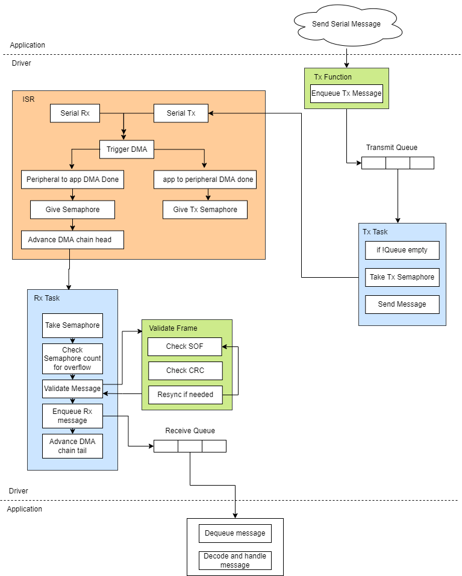

# __Serial Driver and Message Handling Implementation__

## __Scope__
This document covers the design of the serial driver and message handling strategies.  This document depends on other designs, such as an Operating System Abstraction Layer and utilities such as queues and stacks.  The design for those can be found here:

__TODO__ link other docs here

This Serial driver design is targeted to the Vorago processor.  Register set definitions and acronyms can be found here:

__TODO__ link data sheet here

# __Assumptions__

The Serial driver design shall support a multi-tasking Real Time Operating System (RTOS).  The application shall access all UART messages Tx/Rx and initialization functions through the serial driver APIs.  The application shall never make direct calls into the hardware level implementation.

The target RTOS is FreeRTOS, however the design shall support easily switching to a different RTOS with similar capabilities.

DMA shall be used to transfer messages from peripheral to application memory and vice-versa.   
# __Top Level Architecture__



## __Data Structures__

General data structure for serial transactions:
```C++
typedef struct serial_frame{
    uint16_t sof;
    uint8_t data[9]; // data plus DLC and ID
    uint16_t crc;
} serial_frame_t;

typedef struct serial_msg{
    uint16_t id;
    uint8_t  dlc;
    uint8_t data[8];
} serial_msg_t;

typedef struct{
    VOR_UART* uart_ctrl;
    unsigned int uart_handle;
    xQueueHandle_t rx_q_handle;
    xQueueHandle_t tx_q_handle;
    dma_engine_handle_t dma_handle;
    xSemaphoreHandle_t* rx_dma_sem;
    xSemaphoreHandle_t* tx_dma_sem;
    bool if_initd;
}serial_ops_t;
```

## Interface Instantiation
The interface to serial comms shall be done via handles to each interface.  Calls to init shall pass back a handle to the interface initialized or error if no more interfaces are available.  Each interhace shall have it's own serial_ops_t  

## __Tx Function__
The TX function shall enqueue the serial_msg_t message. 
 ## __Rx Function__
 The RX function shall dequeue the serial_msg_t message. 

## __Interrupt Service Routine (ISR)__
The IRQ-router peripheral shall be used to gate the serial interrupt to trigger DMA transactions. The DMA peripheral shall cause an interrupt when the desired amount of data has been DMA'd. 

### __Transmit Interrupts__
Transmit interrupts shall indicate when a full message has been DMA'd from application memory to the UART peripheral and give the TX semaphore indicating that the DMA engine and UART are ready to transmit another message.

### __Receive Interrupts__
Receive interrupts shall indicate when a full message has been DMA'd from peripheral memory to application memory.  The ISR shall give a counting semaphore per DMA complete interrupt. The ISR shall adjust the head pointer of the DMA chain to the next buffer in the chain.  The ISR must disable serial DMA interrupts to reduce the risk of message corruption while processing. 

## __Rx Task__
A single semaphore shall be kept per DMA buffer.  The RX task shall block until a buffer semaphore can be taken. If the semaphore's count is greater than 0, an overflow has occurred and an error shall be set. The rx task shall attempt to validate the frame. If the start of frame byte or crc doesn't match, the rx task shall attempt a frame resync and re-validation.  The rx task shall attempt resync and validations until a valid frame is received. The RX task shall adjust the tail pointer every time the semaphore was taken. The RX task shall copy the id, dlc, and data from serial_frame_t to serial_msg_t message and enqueue the serial_msg_t. 

## __Tx Task__ 
The Tx task shall pend on a transmit queue to send serial messages.  If a message is available for transmit in the queue, the Tx task shall attempt to take a semaphore with a timeout.  If the semaphore is taken, a DMA buffer is available for transmitting a serial message.  The Tx task shall fill in the serial_frame_t for transmitting.   

# __Message Rx Detailed Design__ 
The UART RX interrupt shall be used to trigger a DMA from peripheral to application memory.  When the DMA is complete, the DMA-complete interrupt shall be used to reset DMA parameters and signal to the application that a message is ready for handling.  The application shall perform integrity checks on the message such as SOF, message length and CRC checks.  If any of these checks fails, the frame shall be considered invalid and a resync shall be attempted.  This recovery process shall be repeated until a valid frame is found.  

__dma_driver.c__
```C++

static serial_frame_t rx_dma_chain[DMA_CHANNELS_NUM][DMA_CHAIN_SIZE]; 
static serial_frame_t tx_dma_buffers[DMA_CHANNELS_NUM];

typedef struct dma_ops{
   serial_frame_t* rx_dma_buf; 
   serial_frame_t* tx_dma_buf;
   int dma_head;
   int dma_tail;
   xSemaphoreHandle_t rx_dma_sem;
   xSemaphoreHandle_t tx_dma_sem;
} dma_ops_t;

static dma_ops_t dma_ops[DMA_CHANNELS_NUM] = {{.rx_dma_buf = &rx_dma_chain[0][0], .tx_dma_buf = &tx_dma_buffers[0]},
                                              {.rx_dma_buf = &rx_dma_chain[1][0], .tx_dma_buf = &tx_dma_buffers[1]},
                                              {.rx_dma_buf = &rx_dma_chain[2][0], .tx_dma_buf = &tx_dma_buffers[2]}};

static frame_t frame[DMA_CHAIN_SIZE];
static int msg_rdy;
dma_done_ISR()
{
    if(rx_interrupt){
        /* Set DMA pointer to next address in DMA chain */
        set_dma_pointer(dma_ptr->next);
        
        /* Make sure we didn't overrun */
        int status = semaphoreGive(&dma_sem);
    } else {
        semaphoreGive(&dma_tx_sem);
    }
}
```

```C++
int dma_init(const int dma_handle)
{
    enable_dma_perihperal(dma_handle);
    enable_irq_router_perihperal(dma_handle);
    init_semaphores(dma_handle);

    /* set first address in DMA chain */
    dma_ops[dma_handle].dma_ptr = &frame[0][0];
}
```

```C++
int dma_to_perihperal(const void* msg){
    dma(msg, UARTx); // hardcoded for now
}
```

__dma_driver.h__

```C++
int dma_init(const int dma_handle);
int dma_to_peripheral(const void* msg, int periperal_id);
```

__serial_driver_vorago.c__

```C++


static serial_ops_t serial_ops[NUM_UARTS] = {{.uart_ctrl = VOR_UART_1, .rx_q_handle = uart0_rx_handle, .tx_q_handle = uart0_tx_handle, .rx_dma_sem = rx_dma0_sem, .tx_dma_sem = tx_dma0_sem},
                                             {.uart_ctrl = VOR_UART_2, .rx_q_handle = uart1_rx_handle, .tx_q_handle = uart1_tx_handle, .rx_dma_sem = rx_dma1_sem, .tx_dma_sem = tx_dma1_sem},
                                             {.uart_ctrl = VOR_UART_3, .rx_q_handle = uart2_rx_handle, .tx_q_handle = uart2_tx_handle, .rx_dma_sem = rx_dma2_sem, .tx_dma_sem = tx_dma2_sem}};
```

```C++
int serial_init(void)
{
    static int handle = 0;
    int err = 0;
    if(handle > sizeof(serial_ops)/sizeof(serial_ops[0])){
        err = -1; 
    } else if(serial_ops[handle].if_initd != true) {
        serial_ops[handle].if_initd = true;
        serial_ops[handle].uart_handle = handle;
        err = handle;
        dma_init(handle);
        handle++;
    }

    return err;
}
```

```C++
int static frame_validate(const frame_t* frm)
{
    int err = 0;
    if(frm->sof != FRAME_SOF){
        err = __LINE__;
    } else {
        err = verify_crc(frm);
    }

    return err;
}
```

```C++
static int serial_rx_task(void* arg)
{
    serial_ops_t* serial_ops = (serial_ops_t*)arg;
    while(1){
        int status = semaphoreTake(&serial_ops.rx_dma_sem[tail], timeout);

        if(status == pdTrue){
            // Check semaphore count for overflow conditions
            int count = semaphoreGetCount(&serial_ops.dma_sem[tail]);            
            if(count > 0 ){
                ERROR_SET(SERIAL_OVERFLOW);
            }

            int err = 0;
            serial_frame_t* serial_frame = &frame[tail];
            do{
                err = frame_validate(serial_frame);
                if(err){
                    // if the frame couldn't be validated, read another frame
                    resync_frame(serial_ops.rx_dma_handle, serial_frame);
                }
            } while(err && retries++ < MAX_RETRIES);
        
            if(!err && retries < MAX_RETRIES){
                serial_msg_t msg = {.id = frame.sof & (0x7ff), .dlc = frame.data[DLC_BYTE], .data = &frame.data[DATA_PAYLOAD_START]}
                xQueueSend(serial_ops.rx_q_handle, serial_frame, timeout);
            }
            
            semaphoreGive(serial_ops.rx_dma_sem[tail]);
            tail++;
        }
    }
}
```

```C++
static int serial_tx_task(void* arg)
{
    serial_ops_t* serial_ops = (serial_ops_t*)arg;
    while(1){
        serial_msg_t msg = {0};
        // Try to take the semaphore to determine if the DMA engine and UART are ready for transmitting
        int status = semaphoreTake(serial_ops.tx_dma_sem, timeout);
        if(status == pdTrue){
            // Don't dequeue until we know we can send the message
            status = xQueueRcv(serial_ops.tx_q_handle, &msg, timeout);
            if(status == pdTrue){
                serial_frame_t frame = {.sof = SOF | msg.id};
                memcpy(&frame.data, &msg.dlc, sizeof(frame.data));
                uint16_t crc = {0xffff};
                crc = calc_crc_16(&crc);            
                frame.crc = crc;

                // Try to send the message a few times, because hey, things happen
                do { 
                    err = uart_send(handle, &frame, timeout);
                } while(err && retries++ < MAX_RETRIES);

                // If we're still unsuccessful despite our best attempts...
                if(err && retries == MAX_RETRIES){
                    ERROR_SET(UART_TX_FAILED); // Flush buffer and reset peripheral or whatever is needed to get us talking again
                }
                 
            }
        }
    }
}
```

```C++
// Application calls this function to enqueue the message for transmission
int serial_msg_send(int handle, const serial_msg_t* msg)
{
    int err = 0;
    int status = xQueueSend(serial_ops[handle].rx_q_handle, msg);
    if(status != pdTrue){
        err = __LINE__;
    }
    return err;
}
```

__uart_driver_vorago.c__
```C++
UARTx_tx_ISR(){
    // used to trigger DMA
}

UARTx_rx_ISR(){
   // used to trigger DMA 
}

```C++
// Function that performs hardware level send
int uart_tx(int handle, const frame_t* msg)
{

    // uart tx interrupt used to trigger DMA 
    int err = uart_tx(msg);
    semaphoreGive(&dma_tx_sem);
    return err; 
}
```

```C++
// Function that performs hardware level send
int uart_init(int handle, int baud, interrupt_config_t* interrupt_config)
{

    // uart tx interrupt used to trigger DMA 
    int err = uart_tx(msg);
    semaphoreGive(&dma_tx_sem);
    return err; 
}
```
__uart_driver_vorago.h__
```C++
int uart_tx(int handle, const frame_t* msg);
int uart_init(int handle, int baud, interrupt_config_t* interrupt_config);
```


__serial_driver_vorago.h__
```C++
int serial_msg_send(int handle, const serial_msg_t* msg);
```


__co_can_vorago.c__
```C++
// CANOpen hook 
int serial_ext_msg_rcv(int handle, serial_msg_t* msg, unsigned int delay)
{
    int err = 0;

    // Can we spin up multiple canopen tasks to handle multiple interfaces?
    BaseType_t xStatus = xQueueReceive(serial_ops[handle].rx_q_handle, msg, delay);
    if(xStatus == false) {
        err = __LINE__;
    }
    return err;
}
```
