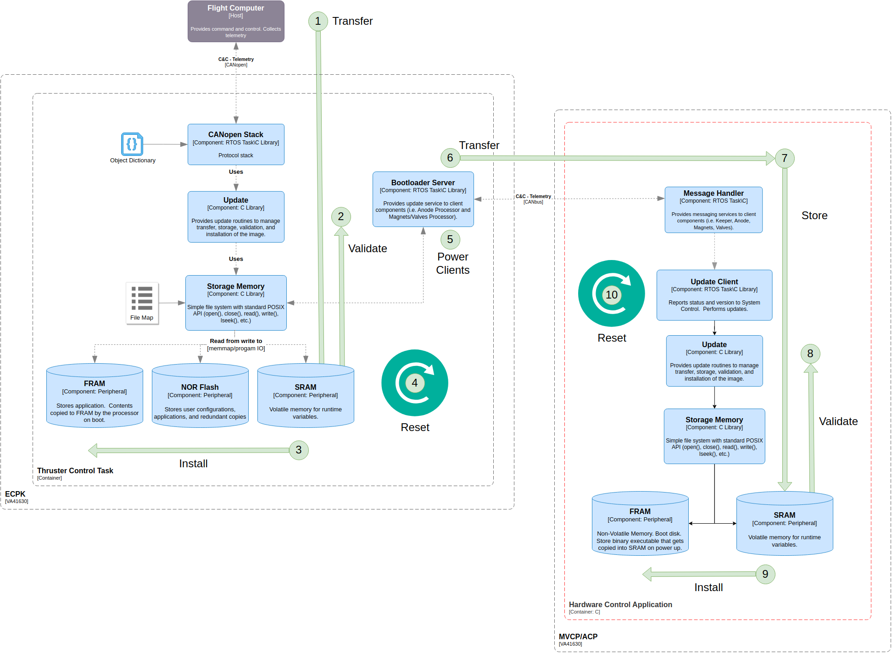
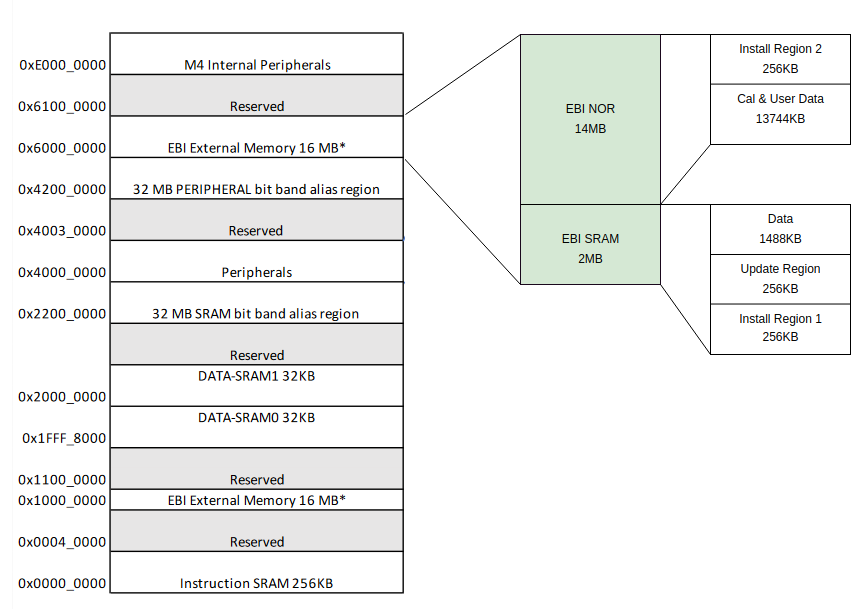

## Update Process

1. Transfer update image over serial to external SRAM update region.
2. Validate update image header and image data.
3. Copy image from update region to redundant region in SRAM and NOR.
Install image data from specified redundant region to FRAM.
4. Reset ECPK.
5. Boot clients and verify versioning.
6. Transfer update image to clients. 
7. Store update image in external SRAM.
8. Validate CRC.
9. Install from SRAM to FRAM

## Memory Map


## Commands
### Update Object CANOpen ID: 0x5500
### Sub ID's:
1. Update Transfer: Sends update image bin through segmented transfer
```
sdo.download(0x5500, 1, self.bytes, force_segment=True)
```

2. Update Image Verify: Verify update image header and data
```
sdo.download(0x5500, 2, bytes(4), force_segment=false) 
```

3. Redundant Image Copy: Copy image from update space to SRAM and NOR.
```
sdo.download(0x5500, 3, bytes(4), force_segment=false) 
```

4. Install App: Copy from specified redundant region to FRAM
```
sdo.download(0x5500, 4, redundant_region, force_segment=false) 
```
